# 360 Degree Info — Customer Service AI Chatbot

A production-style, **customer-aware** support assistant built for a real Chennai
web-development agency ([360degreeinfo.com](https://www.360degreeinfo.com)).

The assistant answers questions using a **Retrieval-Augmented Generation (RAG)**
pipeline over a company knowledge base. Anonymous visitors get **public company
information only**; a signed-in customer additionally gets grounded answers about
**their own** projects, subscriptions and support tickets — and nobody else's.
Authorisation is enforced in the backend *before* retrieval, never in the LLM
prompt.

---

## Table of contents

- [Highlights](#highlights)
- [Screenshots](#screenshots)
- [Architecture](#architecture)
- [How the RAG pipeline works](#how-the-rag-pipeline-works)
- [Security & data-isolation model](#security--data-isolation-model)
- [Tech stack](#tech-stack)
- [Project structure](#project-structure)
- [Running locally](#running-locally)
- [Demo accounts](#demo-accounts)
- [Testing](#testing)
- [Deployment](#deployment)

---

## Highlights

| Area | What it does |
| --- | --- |
| **RAG chat** | Query is embedded, semantically searched against a vector store, and the retrieved passages are passed to an LLM as grounded context. Answers cite nothing they weren't given. |
| **Identity-scoped retrieval** | The vector-store filter is built server-side from the verified JWT: `public` for visitors, `public OR (private AND customer_id = <me>)` for a signed-in customer. |
| **Live data blend** | For a signed-in user the assistant also pulls a fresh snapshot from MySQL (source of truth) so answers about project status / ticket state are never stale. |
| **Query classification** | Each message is classified (company info vs. account question vs. lead vs. ticket intent) by keyword rules, with a single LLM fallback call when the rules don't match. |
| **Conversational ticket raising** | "raise a ticket" triggers a deterministic slot-fill flow (subject → details → priority → confirm) — no LLM call — in addition to the form on the Account page. |
| **Lead capture** | Visitor interest is detected and written to a `leads` table (rate-limited against spam). |
| **Conversation memory** | The last ~5 turns are replayed to the LLM, truncated per message. |
| **Auth** | JWT (bcrypt password hashing), protected routes, password-reset flow, rate-limited auth endpoints. |
| **Admin console** | Separate `/admin` login with its own token type; support-team view of every ticket across all customers, with one-click resolve. |
| **Hardening** | `helmet`, strict CORS allow-list, per-bucket rate limits (global / auth / chat / leads), structured `pino` logging with secret redaction and per-request tracing. |

---

## Screenshots

### Public assistant (visitor)

The assistant answers from the **public** knowledge base only. Follow-up chips are
generated from the answer.

| Landing page | Assistant — empty state | Grounded answer |
| --- | --- | --- |
| 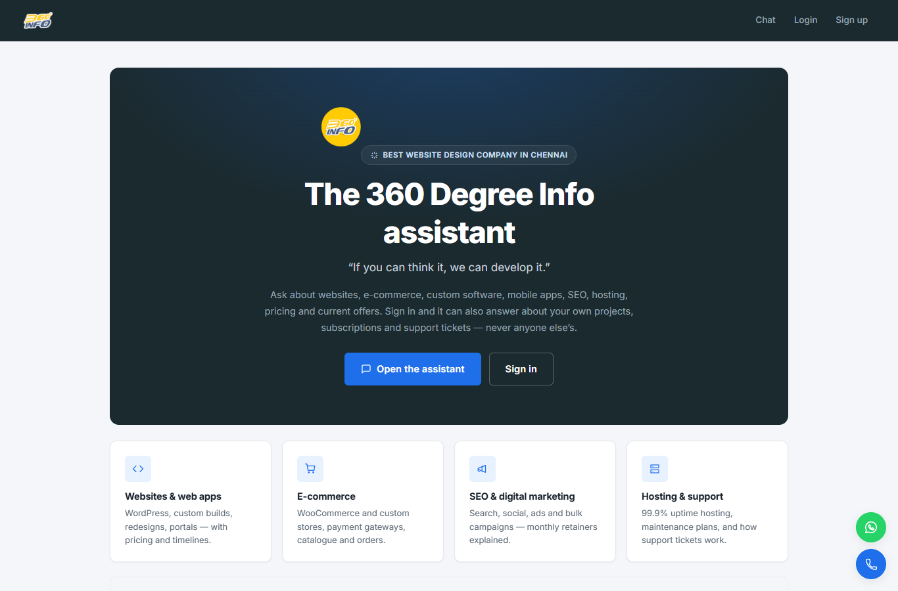 | 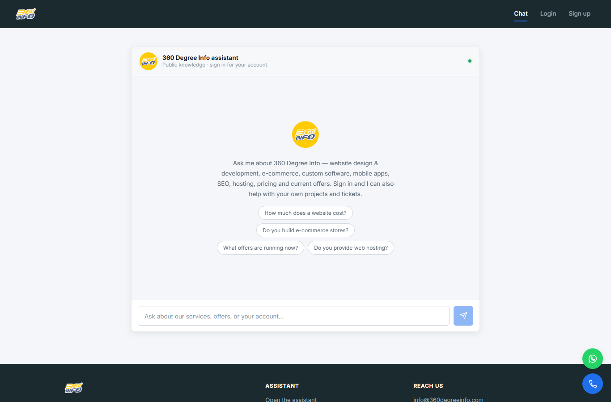 | 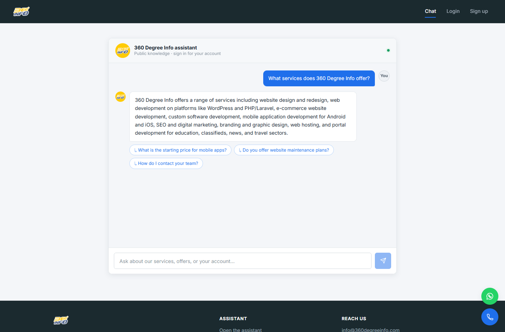 |

### Authentication

Single-step signup, JWT login, and a separate entry point for the support team.

| Login | Sign up | Admin login |
| --- | --- | --- |
| 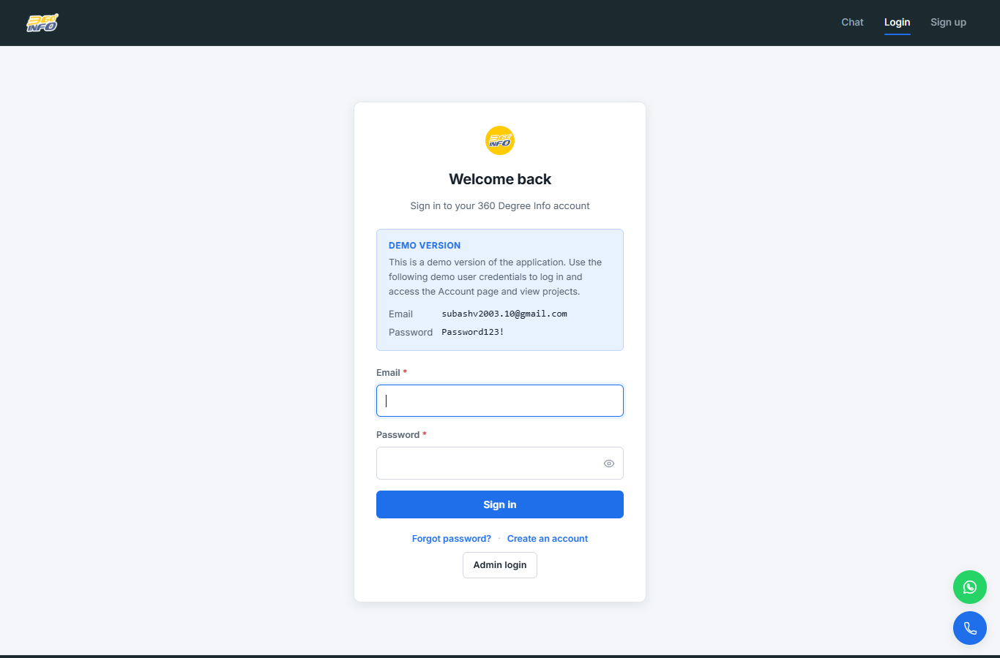 | 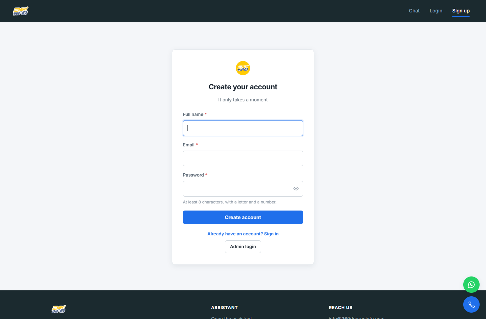 | 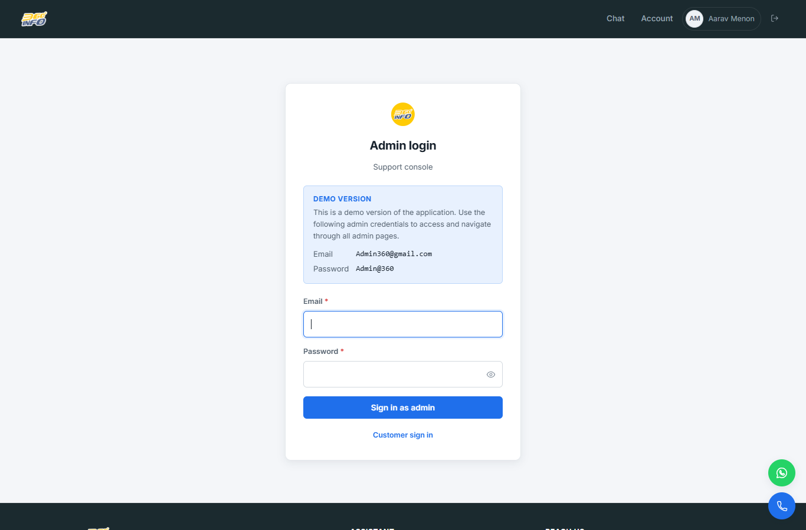 |

### Signed-in customer

Account overview, project detail, and the assistant answering about **this
customer's own** project — pulled live from MySQL and scoped by the JWT.

| Account | Projects | Project detail |
| --- | --- | --- |
| 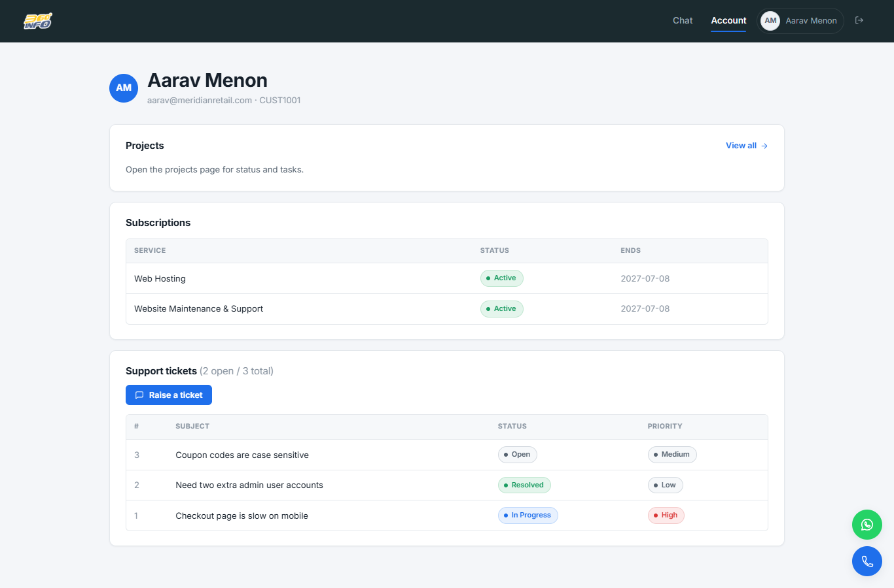 | 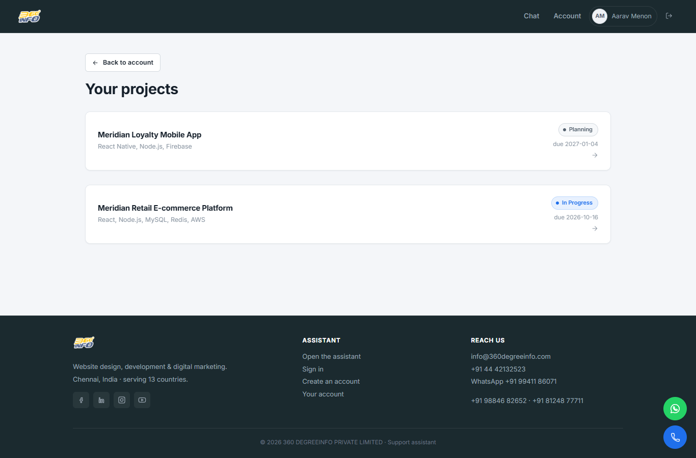 | 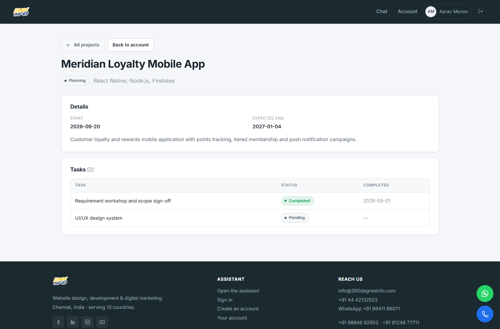 |

| Assistant — personalised empty state | Answer about the customer's own project |
| --- | --- |
| 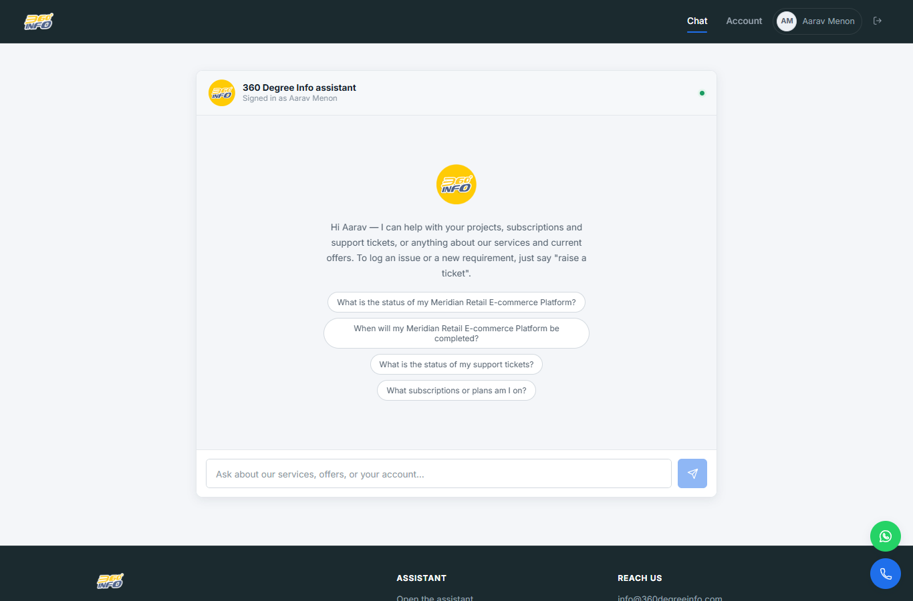 | 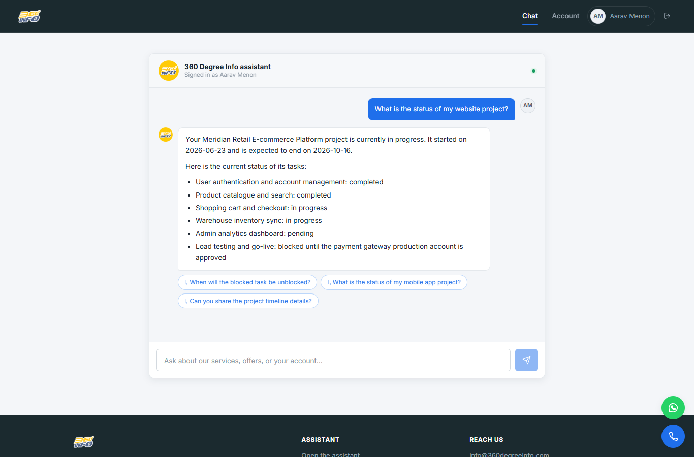 |

### Admin console

Every ticket across all customers, open-first, with a **Resolve** action.

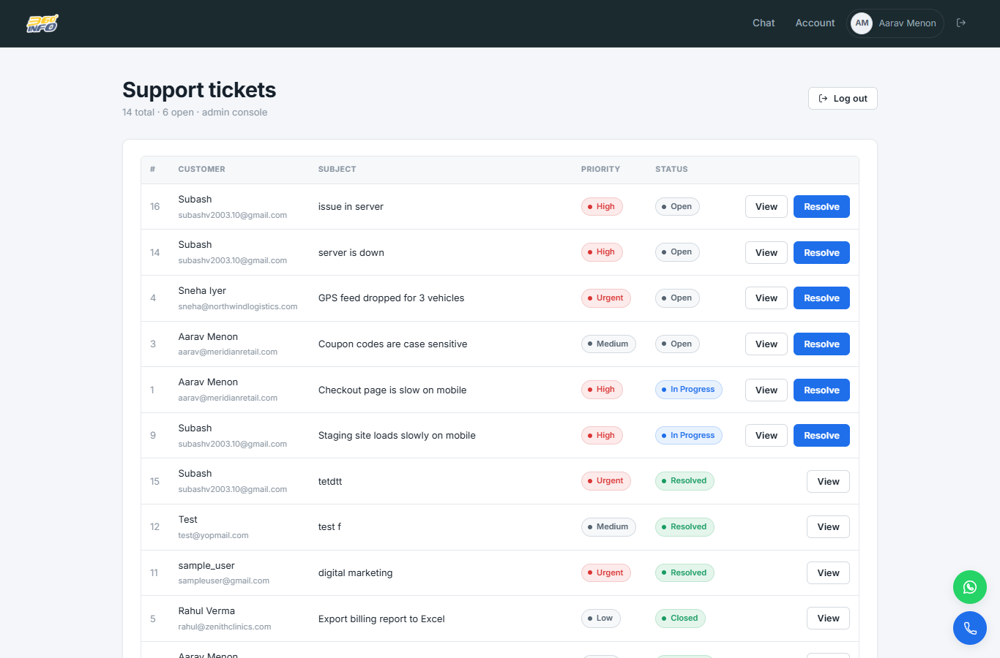

---

## Architecture

```
                 ┌────────────────────────┐
                 │  React + Vite frontend  │   (Vercel)
                 │  /  /chat  /account …   │
                 └───────────┬────────────┘
                             │  HTTPS + Bearer JWT
                 ┌───────────▼────────────┐
                 │  Node.js + Express API  │   (Railway)
                 │  helmet · CORS · rate   │
                 │  limits · pino logging  │
                 └───┬──────────┬──────────┘
        identity from │          │
        verified JWT  │          │
              ┌───────▼───┐  ┌───▼─────────────┐   ┌──────────────┐
              │  MySQL 8   │  │ Retrieval layer │──▶│ Qdrant Cloud  │
              │ (source of │  │ embed → filter  │   │ cs_chatbot_kb │
              │  truth)    │  │ → search → rank │   │ 768-dim       │
              └────────────┘  └───┬─────────────┘   └──────────────┘
                                  │ grounded context
                             ┌────▼──────────────┐   ┌──────────────┐
                             │  LLM service      │──▶│ DeepSeek      │
                             │ (OpenAI-compatible)│   │ chat model    │
                             └───────────────────┘   └──────────────┘
                     embeddings: Google Gemini `gemini-embedding-001`
```

- **MySQL** holds all structured data (customers, projects, tasks, subscriptions,
  tickets, offers, leads, conversations, messages).
- **Qdrant** holds the semantic documents: public company docs
  (`company`, `pricing`, `policies`, `faqs`, `technologies`) and one private
  document per customer, each tagged with `visibility` and `customer_id`.
- **Embeddings** are pluggable (default Gemini, pinned to 768 dims); the **chat
  LLM** is any OpenAI-compatible endpoint (currently DeepSeek).

---

## How the RAG pipeline works

For every `POST /api/chat`:

1. **Optional auth** — a valid Bearer token sets `req.customer`; a visitor is not
   rejected.
2. **Classify** the message (keyword rules → optional one-shot LLM fallback).
3. **Build the retrieval filter server-side** from the verified identity:
   - visitor → `visibility = "public"`
   - customer → `visibility = "public"  OR  (visibility = "private" AND customer_id = <from JWT>)`
4. **Embed** the query and **vector-search** Qdrant with that filter; drop hits
   below `RAG_MIN_SCORE`.
5. For a signed-in caller, **also read a live snapshot** from MySQL (their
   profile / projects / subscriptions / tickets).
6. **Assemble the grounded context** + the last few conversation turns and call
   the LLM. If retrieval fails, the pipeline degrades to "no context" and the
   model answers with an honest "I don't have that information" rather than
   erroring.
7. **Persist** the turn to `conversations` / `messages`.

---

## Security & data-isolation model

These rules are enforced in code, not by prompt instructions:

1. `customer_id` is read from the **verified JWT only** — never from the request
   body or query. A `customer_id` sent by the client on identity-scoped routes is
   rejected (`rejectClientCustomerId`).
2. Authorisation happens in the **backend, before retrieval** — not in the LLM
   prompt.
3. **MySQL** is the source of truth for structured data; **Qdrant** holds
   semantic documents.
4. Private Qdrant documents are **always** filtered by `customer_id`.
5. Unauthenticated users can retrieve **public documents only**.
6. Secrets live in `.env`, are never committed, and are never exposed to React
   (only `VITE_`-prefixed vars reach the browser).
7. The **admin** token is a different token type (`role: "admin"`, no
   `customer_id`); customer routes reject it and admin routes reject customer
   tokens.

Additional hardening: `helmet` security headers, a strict CORS origin allow-list,
`express-rate-limit` buckets (global / auth / chat / leads), 1 MB body cap,
bcrypt password hashing, and `pino` structured logs that redact
`Authorization`, cookies, passwords, OTPs, tokens and API keys.

---

## Tech stack

**Frontend** — React 18, Vite, React Router, Axios, `react-markdown` + `remark-gfm`.

**Backend** — Node.js (ES modules), Express, `mysql2`, `@qdrant/js-client-rest`,
`jsonwebtoken`, `bcryptjs`, `helmet`, `cors`, `express-rate-limit`, `nodemailer`,
`pino` / `pino-http`.

**Data & AI** — MySQL 8 (`cs_chatbot` schema), Qdrant Cloud
(`cs_chatbot_kb`, 768-dim cosine), Google Gemini embeddings
(`gemini-embedding-001`), DeepSeek chat model via an OpenAI-compatible client.

---

## Project structure

```
cs-ai-chatbot/
├── backend/
│   ├── src/
│   │   ├── config/        env, db pool, qdrant client, logger
│   │   ├── routes/        health · auth · customer · chat · ingest · leads · admin
│   │   ├── controllers/   thin HTTP handlers
│   │   ├── services/      auth · retrieval · embedding · llm · classifier ·
│   │   │                  ingestion · conversation · lead · email · admin
│   │   ├── models/        one file per table (SQL lives here)
│   │   ├── middleware/     auth · optionalAuth · admin · rateLimit ·
│   │   │                  authorization · requestLog · error
│   │   └── server.js      app assembly + startup checks
│   ├── database/          schema.sql · seed.sql · seed-subash.sql
│   ├── data/knowledge/    public *.md + private/CUST####.md  (ingested to Qdrant)
│   └── tests/             phase13.mjs (acceptance) · rag-eval.mjs · e2e.mjs
└── frontend/
    └── src/
        ├── pages/         Home · Chat · Login · Signup · ForgotPassword ·
        │                  Account · Projects · ProjectDetail · AdminLogin · Admin
        ├── components/    Navbar · ProtectedRoute · FloatingContact · Icon
        ├── services/      axios instances (customer API + admin API)
        └── utils/         token / adminToken / session helpers
```

---

## Running locally

**Prerequisites:** Node.js 18+, MySQL 8, a Qdrant Cloud collection, and API keys
for Gemini (embeddings) and an OpenAI-compatible chat model (e.g. DeepSeek).

### 1. Database (once)

Run `backend/database/schema.sql`, then `backend/database/seed.sql`, then
optionally `backend/database/seed-subash.sql` (adds the "Subash" demo customer).

### 2. Backend

```bash
cd backend
npm install
cp .env.example .env        # Windows: copy .env.example .env
# fill in MYSQL_*, JWT_SECRET, QDRANT_URL / QDRANT_API_KEY,
#         GEMINI_API_KEY, LLM_PROVIDER / LLM_BASE_URL / LLM_MODEL / LLM_API_KEY
npm run dev                 # http://localhost:5000  (health: /api/health)
```

### 3. Ingest the knowledge base into Qdrant

```bash
curl -X POST http://localhost:5000/api/ingest            # all public + private docs
```

### 4. Frontend

```bash
cd frontend
npm install
cp .env.example .env        # VITE_API_BASE_URL=http://localhost:5000/api
npm run dev                 # http://localhost:5173
```

---

## Demo accounts

Shown on the login screens in the running app:

| Role | Email | Password |
| --- | --- | --- |
| Customer | `subashv2003.10@gmail.com` | `Password123!` |
| Customer | `aarav@meridianretail.com` | `Password123!` |
| Admin | `Admin360@gmail.com` | `Admin@360` |

Each demo customer has their own projects, tasks, subscriptions and tickets, so
the same question ("what's the status of my website project?") returns different,
correctly-scoped answers per account.

---

## Testing

```bash
cd backend
npm run test:acceptance     # tests/phase13.mjs — 10 end-to-end acceptance scenarios
npm run eval:rag            # tests/rag-eval.mjs — RAG answer-quality eval + accuracy table
node tests/e2e.mjs <absLogPath>   # full E2E (backend must log to the same file)
```

All test scripts require a running backend.

---

## Deployment

- **Frontend → Vercel.** `frontend/vercel.json` rewrites all routes to
  `/index.html` (SPA), with `VITE_API_BASE_URL` pointing at the deployed API.
- **Backend → Railway.** `app.set('trust proxy', 1)` in production so rate limits
  key on the real client IP.
- Signup is single-step (no email OTP) on the deployed host because it blocks
  outbound SMTP; the OTP endpoints still exist for API compatibility.

---

<sub>Built as an assessment project. The company, its services and contact details
are real; customer accounts and their project data are fictional seed data.</sub>
